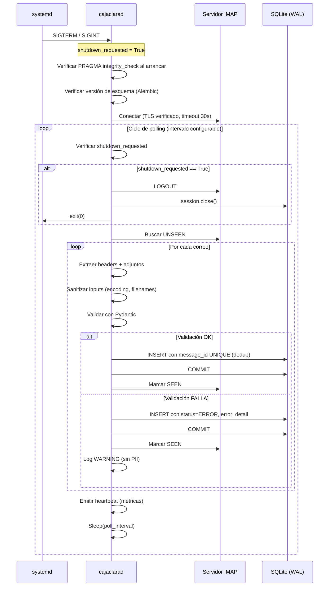

# Plan de Implementación: CajaClara (Rev. 2 — Post-Auditoría)

> [!IMPORTANT]
> Este documento reemplaza en su totalidad al `IMPLEMENTATION_PLAN.md` original tras la auditoría arquitectónica que identificó 6 riesgos críticos, 9 altos y 4 medios. Cada sección incluye referencias `[Riesgo X.Y]` al hallazgo que remedia.

---

## 1. Contexto y Problema de Negocio

**Problema:** Las Pymes gastan horas contabilizando manualmente facturas que llegan por correo electrónico, lo que genera errores humanos y "fugas" de capital (facturas perdidas).

**Solución (CajaClara):** Un demonio Linux (`cajaclarad`) que se conecta de forma segura a uno o más buzones de correo vía IMAP, identifica correos con facturas, extrae metadata clave y la consolida en una base de datos SQLite local. Diseñado para operar 24/7 bajo supervisión de systemd con tolerancia a fallos, idempotencia y apagado elegante.

---

## 2. Arquitectura y Tecnologías

| Componente | Tecnología | Justificación |
|---|---|---|
| Runtime | Python 3.12+ | Soporte LTS, `signal` robusto, typing moderno |
| Gestor de entorno | `uv` (Astral) | Lockfile determinista, resolución ultra-rápida |
| Conexión IMAP | `imap-tools` | API moderna sobre `imaplib`, soporte IDLE |
| Base de datos | SQLite (WAL mode) | Cero fricción, resiliente a crashes `[1.3]` |
| ORM | SQLAlchemy 2.0 | Independiza BD; migración a PostgreSQL con 1 línea |
| Migraciones | Alembic | Evolución de esquema segura y versionada `[4.4]` |
| Validación | Pydantic v2 | Validación estricta de datos entrantes |
| Logging | `structlog` | Logging estructurado JSON `[4.3]` |
| Retry | `tenacity` | Backoff exponencial con jitter `[2.1]` |
| Detección encoding | `charset-normalizer` | Fallback de codificación `[1.4]` |

---

## 3. Diagrama de Flujo Detallado



---

## 4. Estructura del Proyecto

```
caja-clara/
├── pyproject.toml              # Metadata, dependencias, entry point
├── uv.lock                     # Lockfile determinista (generado)
├── alembic.ini                 # Configuración de Alembic
├── alembic/
│   ├── env.py
│   └── versions/               # Migraciones versionadas
├── src/
│   └── caja_clara/
│       ├── __init__.py
│       ├── main.py             # Entry point, signal handlers, loop principal
│       ├── config.py           # Carga de configuración (env vars, validación)
│       ├── imap_client.py      # Conexión IMAP con retry y reconexión
│       ├── extractor.py        # Extracción y sanitización de correos
│       ├── schemas.py          # Modelos Pydantic de validación
│       ├── models.py           # Modelos SQLAlchemy
│       ├── database.py         # Engine, session factory, PRAGMAs
│       ├── logging_config.py   # Configuración structlog + filtro PII
│       └── constants.py        # Límites, timeouts, constantes
├── tests/
│   ├── conftest.py
│   ├── test_database.py
│   ├── test_extractor.py
│   ├── test_imap_client.py
│   ├── test_schemas.py
│   └── test_main.py
├── deploy/
│   └── cajaclarad.service      # Unit file systemd
└── docs/
    └── OPERATIONS.md           # Guía operativa
```

---

## 5. Esquema de Base de Datos `[5.1, 5.2, 5.3]`

### Tabla: `invoice_records`

| Columna | Tipo | Constraints | Notas |
|---|---|---|---|
| `id` | `INTEGER` | `PRIMARY KEY AUTOINCREMENT` | Rowid nativo de SQLite `[5.2]` |
| `message_id` | `TEXT` | `UNIQUE NOT NULL` | RFC 2822 Message-ID, deduplicación `[1.1]` |
| `imap_uid` | `INTEGER` | `NOT NULL` | UID del mensaje en el servidor |
| `mailbox_account` | `TEXT` | `NOT NULL` | Email del buzón monitoreado |
| `sender_email` | `TEXT` | `NOT NULL, INDEX` | Dirección del remitente |
| `received_date` | `DATETIME` | `NOT NULL, INDEX` | Fecha del correo `[5.3]` |
| `subject` | `TEXT` | | Asunto (puede ser NULL en correos malformados) |
| `body_preview` | `TEXT` | | Primeros 500 chars del cuerpo |
| `has_attachments` | `BOOLEAN` | `NOT NULL DEFAULT FALSE` | |
| `attachment_filename` | `TEXT` | | Nombre sanitizado del adjunto |
| `attachment_hash` | `TEXT` | | SHA-256 del contenido del adjunto `[1.5]` |
| `attachment_size_bytes` | `INTEGER` | | Tamaño en bytes (pre-validado) |
| `status` | `TEXT` | `NOT NULL DEFAULT 'PENDING', INDEX` | Enum: PENDING, PROCESSED, ERROR `[5.3]` |
| `error_detail` | `TEXT` | | Razón del fallo cuando status=ERROR `[1.4]` |
| `created_at` | `DATETIME` | `NOT NULL DEFAULT CURRENT_TIMESTAMP` | |
| `updated_at` | `DATETIME` | `NOT NULL DEFAULT CURRENT_TIMESTAMP` | Trigger on UPDATE `[5.1]` |

### Índices explícitos `[5.3]`

- `ix_invoice_records_sender_email` → `sender_email`
- `ix_invoice_records_received_date` → `received_date`
- `ix_invoice_records_status` → `status`
- `uq_invoice_records_message_id` → `message_id` (implícito por UNIQUE)

---

## 6. Gestión de Estado y Resiliencia

### 6.1 Idempotencia y Deduplicación `[1.1]`

**Garantía:** El sistema es **at-least-once con deduplicación**. Es imposible lograr exactly-once entre dos sistemas sin 2PC.

**Mecanismo:**
1. Extraer `Message-ID` del header RFC 2822 del correo.
2. `INSERT INTO invoice_records (message_id, ...) ON CONFLICT(message_id) DO NOTHING`.
3. Si el INSERT tiene efecto → COMMIT → marcar SEEN en IMAP.
4. Si el INSERT no tiene efecto (duplicado) → marcar SEEN en IMAP (sin error).
5. Si el COMMIT falla → NO marcar SEEN → el correo se reprocesará en el siguiente ciclo (y la deduplicación lo resolverá).

**Caso borde - crash entre COMMIT y marca SEEN:** El correo se reprocesa, el INSERT se rechaza por `message_id` duplicado, se marca SEEN. Sin duplicados. Sin pérdida.

### 6.2 Transacciones SQLite `[1.2, 1.3]`

```python
# database.py - Configuración del engine
engine = create_engine(
    "sqlite:///path/to/cajaclarad.db",
    connect_args={"timeout": 15},  # busy_timeout
    pool_pre_ping=True,
)


@event.listens_for(engine, "connect")
def set_sqlite_pragmas(dbapi_conn, connection_record):
    cursor = dbapi_conn.cursor()
    cursor.execute("PRAGMA journal_mode=WAL")
    cursor.execute("PRAGMA busy_timeout=5000")
    cursor.execute("PRAGMA foreign_keys=ON")
    cursor.execute("PRAGMA synchronous=NORMAL")  # WAL-safe
    cursor.close()
```

- Cada correo procesado dentro de un bloque `with Session(engine) as session, session.begin():`.
- Rollback automático si cualquier excepción ocurre dentro del bloque.
- `sqlite3.OperationalError: database is locked` manejado con retry (3 intentos, backoff 1s/2s/4s).
- **Al arrancar:** ejecutar `PRAGMA integrity_check` y abortar si la BD está corrupta.

### 6.3 Deduplicación a nivel de negocio `[1.5]`

**Decisión de scope:** La deduplicación a nivel de contenido de factura (mismo proveedor envía la misma factura en 3 correos distintos) se difiere a Fase 2.

**Preparación en Fase 1:** Se almacena `attachment_hash` (SHA-256) en la BD. Esto permite implementar alertas de "posible duplicado" en Fase 2 sin migración de esquema.

**Limitación documentada:** Fase 1 solo deduplicará por `Message-ID`. Correos distintos con la misma factura generarán registros separados.

---

## 7. Manejo de Correos Hostiles y Malformados `[1.4]`

### Límites y constantes (`constants.py`)

```python
MAX_ATTACHMENT_SIZE_BYTES = 25 * 1024 * 1024  # 25 MB
MAX_BODY_LENGTH_CHARS = 100_000  # 100K caracteres
MAX_SUBJECT_LENGTH = 998  # RFC 2822
MAX_FILENAME_LENGTH = 255  # POSIX
ALLOWED_ATTACHMENT_EXTENSIONS = {".pdf", ".xml", ".xlsx", ".csv", ".png", ".jpg"}
```

### Pipeline de sanitización

1. **Encoding:** Intentar decodificar con charset declarado → fallback a `charset-normalizer` → fallback a `latin-1` (nunca falla).
2. **Headers faltantes:** Si no hay `From:`, usar string vacío y marcar `status=ERROR` con `error_detail="Missing From header"`.
3. **Fechas inválidas:** Parsear con `email.utils.parsedate_to_datetime()` → fallback a `datetime.now(UTC)` con log WARNING.
4. **Nombres de archivo:**
   - `os.path.basename()` para eliminar path traversal.
   - Regex whitelist: `re.sub(r'[^\w\-.]', '_', filename)`.
   - Rechazar si la extensión no está en `ALLOWED_ATTACHMENT_EXTENSIONS`.
5. **Tamaño de adjunto:** Verificar `len(payload)` antes de procesar. Si excede `MAX_ATTACHMENT_SIZE_BYTES`, registrar con `status=ERROR`.
6. **Caracteres null:** `subject.replace('\x00', '')` antes de almacenar.

---

## 8. Resiliencia de Red IMAP `[2.1, 2.2, 3.4]`

### Modelo de ejecución: Polling `[2.2]`

**Decisión:** Fase 1 usa **polling con intervalo configurable** (default: 120 segundos).

**Justificación:** IMAP IDLE requiere mantener una conexión TCP abierta permanentemente, lo cual añade complejidad de reconexión y es incompatible con ciertos proxies/firewalls corporativos. Se difiere a Fase 2 como optimización.

### Reconexión con backoff `[2.1]`

```python
# imap_client.py
from tenacity import retry, stop_after_attempt, wait_exponential, wait_random


@retry(
    stop=stop_after_attempt(5),
    wait=wait_exponential(multiplier=1, min=2, max=120) + wait_random(0, 5),
    reraise=True,
)
def connect(self) -> None:
    """Establece conexión IMAP con TLS verificado."""
    ctx = ssl.create_default_context()  # Verifica certificados [3.4]
    # NUNCA: ctx.check_hostname = False
    # NUNCA: ctx.verify_mode = ssl.CERT_NONE
    self._mailbox = MailBox(self._host, port=self._port, ssl_context=ctx)
    self._mailbox.login(self._user, self._password)
```

- **Socket timeout:** 30s connect, 60s read (configurables).
- **Tras 5 reintentos fallidos:** el demonio entra en estado `DEGRADED`, emite log CRITICAL, y espera 10 minutos antes de reintentar el ciclo completo.
- **Conexión stale:** antes de cada ciclo de polling, verificar la conexión con `NOOP`. Si falla, reconectar.

### Límites conocidos de proveedores

| Proveedor | Límite | Mitigación |
|---|---|---|
| Gmail | ~2500 conexiones/día, OAuth2 obligatorio | Reusar conexión, no reconectar innecesariamente |
| Outlook 365 | ~20 conexiones concurrentes | Una sola conexión por buzón |
| Genérico | Timeout IDLE: 30 min | N/A en Fase 1 (polling) |

---

## 9. Seguridad de la Información `[3.1, 3.2, 3.3, 3.4]`

### 9.1 Gestión de credenciales `[3.1]`

**Mecanismo primario:** Variables de entorno del sistema, inyectadas vía `Environment=` o `EnvironmentFile=` en la unit de systemd.

```ini
# /etc/cajaclarad/env (permisos 0600, owner cajaclarad:cajaclarad)
CAJACLARAD_IMAP_HOST=imap.example.com
CAJACLARAD_IMAP_PORT=993
CAJACLARAD_IMAP_USER=facturas@example.com
CAJACLARAD_IMAP_PASSWORD=app-password-aqui
CAJACLARAD_DB_PATH=/var/lib/cajaclarad/cajaclarad.db
CAJACLARAD_POLL_INTERVAL=120
CAJACLARAD_LOG_LEVEL=INFO
```

**Validación al arrancar:** `config.py` usa un modelo Pydantic `Settings` que valida la presencia y formato de todas las variables. Si falta alguna, el demonio rechaza arrancar con un mensaje de error explícito (sin imprimir el valor de la variable).

**OAuth2:** Se documenta como requisito para Gmail y Outlook 365 corporativos. Fase 1 soporta autenticación por App Password. Fase 2 implementará XOAUTH2 con refresh token.

**Prohibiciones:**
- Las credenciales NUNCA se almacenan en la BD.
- Las credenciales NUNCA se imprimen en logs (ni siquiera en DEBUG).
- No se usa `.env` en el directorio del proyecto en producción.

### 9.2 Permisos del sistema de archivos `[3.2]`

| Recurso | Permisos | Owner |
|---|---|---|
| `/var/lib/cajaclarad/` | `0700` | `cajaclarad:cajaclarad` |
| `/var/lib/cajaclarad/cajaclarad.db` | `0600` | `cajaclarad:cajaclarad` |
| `/etc/cajaclarad/env` | `0600` | `cajaclarad:cajaclarad` |
| `/var/log/cajaclarad/` | `0750` | `cajaclarad:adm` |

El usuario de sistema `cajaclarad` se crea sin shell de login (`/usr/sbin/nologin`) y sin directorio home.

### 9.3 Política anti-fuga en logs `[3.3]`

**Clasificación de campos PII:**
- `sender_email` → se redacta a `s***r@example.com` en INFO+.
- `subject` → se trunca a 20 caracteres con `[REDACTED]` en INFO+.
- Contenido del cuerpo → NUNCA se loggea excepto en DEBUG.
- Credenciales → NUNCA se loggean en ningún nivel.

**Implementación:** Procesador custom de `structlog` que aplica redacción antes de emitir el log.

```python
# logging_config.py
def redact_pii(_, __, event_dict):
    if "sender_email" in event_dict:
        email = event_dict["sender_email"]
        local, domain = email.split("@", 1) if "@" in email else (email, "")
        event_dict["sender_email"] = f"{local[0]}***{local[-1]}@{domain}" if len(local) > 1 else "***"
    if "subject" in event_dict:
        event_dict["subject"] = event_dict["subject"][:20] + "[REDACTED]"
    return event_dict
```

### 9.4 TLS `[3.4]`

- Se usa `ssl.create_default_context()` que verifica certificados por defecto.
- Está **explícitamente prohibido** en el código deshabilitar `check_hostname` o setear `verify_mode = CERT_NONE`.
- Se agrega un comentario de advertencia en `imap_client.py` y un test que verifica que la verificación TLS está activa.

---

## 10. Ciclo de Vida del Demonio `[4.1, 4.2]`

### 10.1 Graceful shutdown `[4.1]`

```python
# main.py
import signal
import threading

shutdown_event = threading.Event()


def _handle_signal(signum, frame):
    log.info("señal_recibida", signal=signal.Signals(signum).name)
    shutdown_event.set()


def main():
    signal.signal(signal.SIGTERM, _handle_signal)
    signal.signal(signal.SIGINT, _handle_signal)

    # Verificaciones de arranque
    verify_db_integrity()
    verify_schema_version()

    while not shutdown_event.is_set():
        try:
            process_mailbox()
        except Exception:
            log.exception("error_ciclo_principal")
        shutdown_event.wait(timeout=config.poll_interval)

    # Apagado limpio
    log.info("apagado_iniciado")
    imap_client.logout()
    db_session.close()
    log.info("apagado_completado")
    sys.exit(0)
```

**Comportamiento:**
1. `SIGTERM`/`SIGINT` → setea `shutdown_event`.
2. El loop principal verifica el evento entre iteraciones.
3. Si hay una transacción en curso, se completa (no se aborta).
4. Se cierra la sesión SQLAlchemy limpiamente.
5. Se envía IMAP `LOGOUT`.
6. Exit con código 0.

### 10.2 Integración systemd `[4.2]`

```ini
# deploy/cajaclarad.service
[Unit]
Description=CajaClara - Demonio de extracción de facturas IMAP
Documentation=https://github.com/user/caja-clara
After=network-online.target
Wants=network-online.target

[Service]
Type=simple
User=cajaclarad
Group=cajaclarad
EnvironmentFile=/etc/cajaclarad/env
ExecStart=/opt/cajaclarad/venv/bin/cajaclarad
Restart=on-failure
RestartSec=30
TimeoutStopSec=30
WatchdogSec=300

# Hardening
ProtectSystem=strict
ProtectHome=yes
PrivateTmp=yes
PrivateDevices=yes
NoNewPrivileges=yes
ReadWritePaths=/var/lib/cajaclarad /var/log/cajaclarad
CapabilityBoundingSet=
SystemCallFilter=@system-service

StandardOutput=journal
StandardError=journal
SyslogIdentifier=cajaclarad

[Install]
WantedBy=multi-user.target
```

**Directivas clave:**
- `Restart=on-failure` + `RestartSec=30`: reinicio automático tras crash.
- `TimeoutStopSec=30`: systemd envía SIGTERM, espera 30s, luego SIGKILL. El graceful shutdown debe completar en <30s.
- `WatchdogSec=300`: si el demonio no emite heartbeat en 5 minutos, systemd lo considera muerto (requiere `sd_notify` — ver Fase 2).
- Hardening: `ProtectSystem=strict`, `PrivateTmp`, `NoNewPrivileges`, `CapabilityBoundingSet=` vacío.

---

## 11. Logging y Telemetría `[4.3]`

### Configuración de logging

- **Librería:** `structlog` con output JSON.
- **Destino:** `stdout` → capturado por `journald` vía la unit de systemd.
- **Formato:**

```json
{
  "timestamp": "2026-08-30T07:15:33.421Z",
  "level": "info",
  "event": "correo_procesado",
  "message_id": "<abc123@mail.example.com>",
  "sender_email": "p***r@proveedor.com",
  "status": "PROCESSED",
  "duration_ms": 142
}
```

### Métricas de salud

El demonio escribe un archivo de estado atómico en cada ciclo:

```python
# /var/lib/cajaclarad/status.json (escrito atómicamente con rename)
{
    "pid": 12345,
    "uptime_seconds": 3600,
    "last_successful_cycle": "2026-08-30T07:15:33Z",
    "emails_processed_total": 247,
    "emails_errored_total": 3,
    "imap_connection_status": "connected",
    "db_size_bytes": 1048576,
}
```

Escritura atómica: escribir a `status.json.tmp` → `os.rename()` → nunca se lee un archivo parcial.

---

## 12. Migraciones de Esquema `[4.4]`

- **Herramienta:** Alembic (incluido como dependencia).
- **Flujo de migración:**
  1. Desarrollador: `alembic revision --autogenerate -m "descripción"`
  2. Revisar SQL generado manualmente.
  3. Aplicar: `alembic upgrade head`
- **Verificación al arrancar:** El demonio compara la versión de Alembic en la BD con la versión `head` del código. Si no coinciden, rechaza arrancar con log CRITICAL:

```python
def verify_schema_version():
    current = get_current_revision(engine)
    expected = get_head_revision()
    if current != expected:
        log.critical("version_esquema_incompatible", current=current, expected=expected)
        sys.exit(1)
```

---

## 13. Empaquetado y Despliegue con uv `[6.1]`

### `pyproject.toml`

```toml
[project]
name = "caja-clara"
version = "0.1.0"
requires-python = ">=3.12"
dependencies = [
    "imap-tools>=1.7.0",
    "sqlalchemy>=2.0",
    "alembic>=1.13",
    "pydantic>=2.0",
    "pydantic-settings>=2.0",
    "structlog>=24.0",
    "tenacity>=8.0",
    "charset-normalizer>=3.0",
]

[project.scripts]
cajaclarad = "caja_clara.main:main"

[tool.uv]
dev-dependencies = [
    "pytest>=8.0",
    "pytest-cov>=5.0",
    "flake8>=7.0",
    "bandit>=1.7",
]
```

### Flujo de despliegue

```bash
# En el servidor de producción
cd /opt/cajaclarad
git pull origin main
uv sync --frozen          # Instala exactamente lo del lockfile
uv run alembic upgrade head  # Aplica migraciones pendientes
sudo systemctl restart cajaclarad
sudo systemctl status cajaclarad
```

- `uv.lock` se commitea al repositorio para builds deterministas.
- `uv sync --frozen` falla si el lockfile no existe o está desactualizado, previniendo builds no deterministas.

---

## 14. Fases de Desarrollo

### Fase 1: Cimientos (esta iteración)
1. **Configuración Base:** `pyproject.toml`, `uv sync`, `alembic init`, estructura de directorios.
2. **Capa de BD:** Modelos SQLAlchemy, PRAGMAs, session factory, migración inicial. Tests unitarios.
3. **Capa IMAP:** Cliente con retry/backoff, sanitización, extracción. Tests con mocks.
4. **Orquestación:** Loop principal, signal handlers, graceful shutdown, Pydantic en medio.
5. **Operaciones:** Unit systemd, logging structlog, archivo de estado.
6. **Auditoría final:** `pytest --cov` ≥ 85%, `flake8`, `bandit`.

### Fase 2: Endurecimiento (futura)
- IMAP IDLE (push en lugar de polling).
- OAuth2 / XOAUTH2 para Gmail y Outlook 365.
- Deduplicación de facturas a nivel de negocio (por `attachment_hash`).
- `sd_notify` para watchdog de systemd.
- Dashboard mínimo de monitoreo (lectura de `status.json`).

---

## Verificación

### Tests automatizados
```bash
uv run python -m pytest tests/ -v --cov=src/caja_clara --cov-report=term-missing
uv run python -m flake8 src/ tests/
uv run bandit -r src/ -c pyproject.toml
```

### Verificación manual
- Enviar correos de prueba (normales, sin adjunto, con encoding roto, con adjunto >25MB).
- Matar el proceso con `kill -9` a mitad de procesamiento y verificar que no hay duplicados ni corrupción.
- Ejecutar `systemctl stop cajaclarad` y verificar apagado limpio en journald.
- Verificar permisos de archivos en producción.

---

## Limitaciones Conocidas (Fase 1)

1. No hay deduplicación a nivel de contenido de factura (solo por `Message-ID`).
2. No hay soporte OAuth2 (solo App Passwords).
3. No hay IMAP IDLE (solo polling).
4. No hay extracción de datos *dentro* de la factura (OCR/parsing de PDF). Solo se registra metadata del correo y adjunto.
5. Soporte para un único buzón por instancia del demonio.

---

## Acción Requerida

**Estado:** Esperando aprobación post-auditoría.
- Si se aprueba: proceder a crear `task.md` y ejecutar Fase 1.
- Si requiere cambios: indicar con `[CHANGES_REQUESTED]` y feedback.
