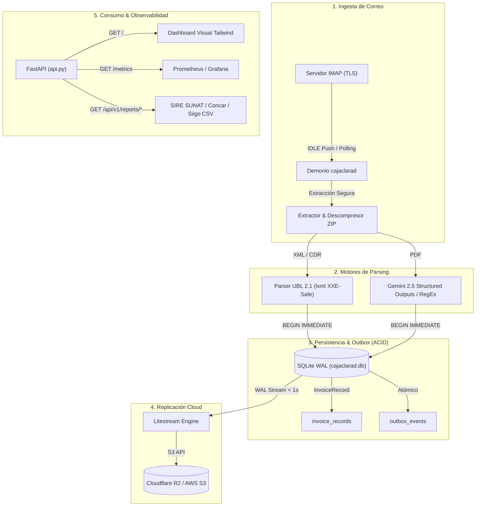

# CajaClara — Plataforma Fiscal y Concurrencia Enterprise

> **Del correo a la contabilidad. Sin humanos. Sin errores. Sin facturas perdidas.**

---

## 🚀 El Problema

Cada semana, los contadores y gerentes de empresas dedican entre **5 y 10 horas** a descargar facturas de proveedores manualmente, descomprimir ZIPs con XML/CDR y pasarlas a Excel o sistemas contables.
El costo real no son las horas, es la factura traspapelada, la pérdida del crédito fiscal o la no declaración de detracciones SPOT que ocasiona multas ante la administración tributaria.

---

## ⚡ La Solución

**CajaClara** automatiza integralmente el ciclo de vida fiscal y contable:

1. **Demonio IMAP Resiliente:** Escucha eventos de correo en tiempo real mediante `IDLE` push (con fallback a polling), transaccionalidad estricta del flag `\Seen` y backoff exponencial con jitter.
2. **Motor Fiscal UBL 2.1 Determinista:** Parser nativo seguro contra ataques XXE y DoS para Facturas, Boletas, Notas de Crédito, Notas de Débito y Constancias de Recepción (CDR) SUNAT.
3. **Descompresión en Memoria Anti-ZipBomb:** Procesamiento seguro de archivos `.zip` sin tocar disco, priorizando flujos XML deterministas sobre PDFs para reducir costos de IA.
4. **Inteligencia GenAI para PDFs:** Extracción con Gemini 2.5 Flash Structured Outputs (`temperature=0.0`) y fallback heurístico determinista.
5. **Persistencia Concurrente (SQLite WAL + BEGIN IMMEDIATE):** Inyección de `BEGIN IMMEDIATE` y pragmas de alto rendimiento para erradicar bloqueos `SQLITE_BUSY` (1 escritor + N lectores simultáneos).
6. **Patrón Transactional Outbox:** Inserción atómica de comprobantes y eventos (`outbox_events`) en la misma transacción ACID para cero dual-write en integraciones con ERPs.
7. **Firmas Criptográficas HMAC-SHA256:** Notificación de Webhooks con cabecera `X-CajaClara-Signature` y ventana de tolerancia temporal anti-replay.
8. **Observabilidad Prometheus:** Endpoint `/metrics` con métricas OpenMetrics, histogramas de latencia, gauges de estado y ofuscación universal de datos personales (PII).
9. **Disaster Recovery (Litestream):** Replicación continua del WAL hacia almacenamiento compatible con S3 (Cloudflare R2 / AWS S3) con RPO < 1s.
10. **Exportadores Contables Integrados:** Generador del Registro de Compras Electrónico (SIRE / RCE SUNAT) y CSV estándar para Concar, Siigo, Starsoft y Excel.

---

## 🏗️ Arquitectura del Sistema



---

## 📊 Matriz de Capacidades

| Capacidad | Tecnología / Mecanismo | Garantía / SLA |
|---|---|---|
| **Formato Fiscal** | XML UBL 2.1 + CDRs SUNAT | Extracción determinista de Subtotal, IGV, Total y Detracciones SPOT |
| **Protección DoS** | Anti-ZipBomb (20 archivos / 10MB) + Anti-PDFBomb (20 págs) | Consumo de RAM < 45MB bajo Cgroups v2 |
| **Concurrencia** | `PRAGMA journal_mode=WAL` + `BEGIN IMMEDIATE` | Cero colisiones de escritura (`SQLITE_BUSY`) entre demonio y API |
| **Desacoplamiento ERP** | Transactional Outbox + Firmas HMAC-SHA256 | Entrega *at-least-once* sin dual-write ni replay attacks |
| **Observabilidad** | `prometheus-client` + `structlog` | Formato OpenMetrics `/metrics` y PII 100% ofuscado en logs |
| **Disaster Recovery** | Litestream | Streaming de WAL a S3/R2 con RPO < 1s y RTO < 10s |
| **Calidad de Código** | Pytest + Ruff + Bandit | 100% pruebas en verde, cobertura real $\ge 85\%$ sin mocks de BD |

---

## 🛠️ Stack Tecnológico

| Capa | Tecnologías |
|---|---|
| **Lenguaje y Entorno** | Python 3.12+ / [`uv`](https://docs.astral.sh/uv/) |
| **Base de Datos & ORM** | SQLite (WAL mode) + SQLAlchemy 2.0 + Alembic |
| **Protocolo de Correo** | `imap-tools` con autenticación TLS / XOAUTH2 |
| **Validación y Tipos** | Pydantic v2 + tipos escalados `Decimal` |
| **Parsers** | `lxml` (XXE safe) + `pdfplumber` + `pypdf` + `google-genai` |
| **API REST & UI** | FastAPI + Jinja2 + Tailwind CSS + Prometheus Client |
| **Contenedores & Proxy** | Docker Compose + Caddy (HTTPS automático) |

---

## 🚦 Inicio Rápido (Local)

### Prerrequisitos
- Python 3.12+
- `uv` instalado (`curl -LsSf https://astral.sh/uv/install.sh | sh`)

```bash
# 1. Clonar el repositorio
git clone https://github.com/samuelchaupis-cloud/caja-clara.git
cd caja-clara

# 2. Instalar dependencias con uv
uv sync

# 3. Configurar variables de entorno
cp .env.example .env

# 4. Ejecutar la suite de calidad (Iron Law)
uv run ruff check .
uv run bandit -r src/ -ll -ii
uv run pytest tests/ -v --cov=src --cov-fail-under=85

# 5. Iniciar la API y el Dashboard
uv run uvicorn src.caja_clara.api:app --reload
```

Acceder al Dashboard en `http://localhost:8000` y a las métricas Prometheus en `http://localhost:8000/metrics`.

---

## 🐳 Despliegue en Producción (Docker Compose)

```bash
# Iniciar servicios con Caddy y proxy inverso
docker-compose up -d --build

# Monitorear logs en vivo
docker-compose logs -f app
```

---

## 📄 Licencia

Este proyecto está licenciado bajo los términos de la licencia MIT.
